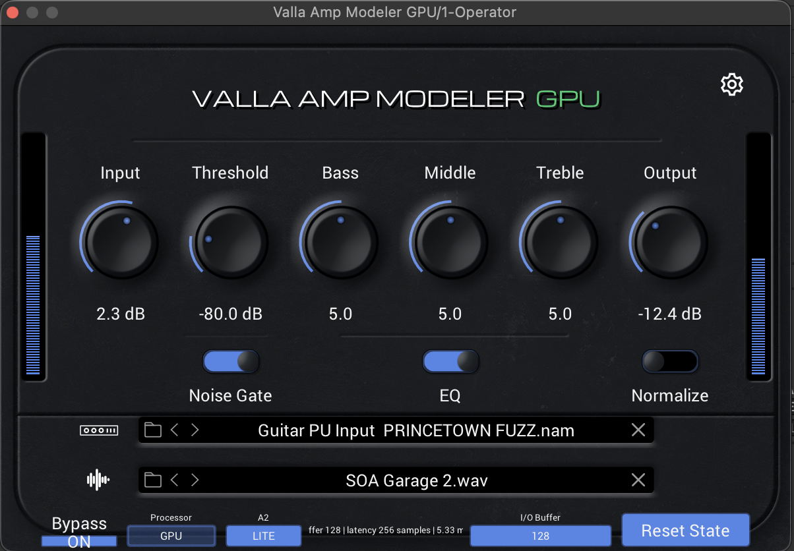

# Valla Amp Modeler GPU



**Valla Amp Modeler GPU** is an independent amp modeler based on NeuralAmpModelerCore, with selectable CPU and GPU processing optimized for Apple Silicon and Apple Metal.

It supports **NAM A2 model profiles** and external **Impulse Response (IR)** files, providing an efficient workflow for guitar and bass amp modeling on Apple Silicon systems.

> [!IMPORTANT]
> Valla Amp Modeler GPU processes **NAM A2 profiles only**.
>
> Legacy NAM models and NAM profiles using architectures other than A2 are not supported.

## CPU and GPU Processing

Starting with the latest **beta_V2 release**, Valla Amp Modeler GPU can process audio using either the **CPU** or the **GPU**.

The processing engine can be selected directly from the plug-in interface.

### GPU Processing

GPU mode processes **NAM A2 inference through Apple Metal**, while **Impulse Response convolution is always processed on the CPU**.

It supports both processing quality modes:

* **LITE**
* **FULL**

GPU processing is recommended when:

* Running multiple simultaneous instances
* Using FULL processing quality
* Working with large DAW projects
* Preserving CPU resources for virtual instruments and effects
* Rendering or mixing final tracks

### CPU Processing

CPU mode processes the NAM model directly on the CPU.

When CPU processing is selected:

* The plug-in reports **0 samples of additional latency**
* Processing quality is automatically forced to **LITE**
* FULL mode is unavailable
* The quality selector remains locked to LITE until GPU processing is selected again

CPU mode can be useful for:

* Low-latency monitoring
* Recording
* Smaller sessions
* Troubleshooting GPU-related playback issues
* Systems where GPU resources are already heavily occupied

> [!NOTE]
> The reported zero latency refers only to the additional latency reported by the plug-in.
>
> The total monitoring latency still depends on the DAW buffer, audio interface, converters, drivers, and the rest of the audio system.

## Why GPU Acceleration?

GPU acceleration is not primarily intended to reduce the latency of a single NAM instance.

Its main advantage is to expand the total processing capacity available in large projects.

In complex DAW sessions, the CPU often becomes the primary bottleneck while a significant amount of GPU processing power remains unused.

By moving NAM A2 inference to the GPU while keeping IR convolution on the CPU, Valla Amp Modeler GPU makes use of otherwise idle GPU resources and reduces the CPU workload required by the NAM model. This preserves additional CPU capacity for:

* Virtual instruments
* Audio effects
* Mixing and bus processing
* Automation
* Oversampling
* Other real-time DAW operations

The objective is not simply to make one amp model faster, but to distribute the processing workload more efficiently across the system.

This can be particularly useful in large projects where CPU resources are already heavily occupied but GPU processing capacity is still available.

## Performance Reference

The GPU engine has been tested on the following system:

* **Computer:** MacBook Pro
* **Processor:** Apple M4 Max, 14-core CPU
* **Sample rate:** 48 kHz
* **NAM processing:** One NAM A2 profile per instance
* **Cabinet processing:** One external IR per instance, processed on the CPU

### Test Results

|  DAW Buffer | Sample Rate | Simultaneous Instances | VaM Buffer | VaM Mode |
| ----------: | ----------: | ---------------------: | ---------: | -------: |
|  64 samples |      48 kHz |           48 instances |         64 |     FULL |
| 128 samples |      48 kHz |           75 instances |        128 |     FULL |
|  64 samples |      48 kHz |           75 instances |         64 |     LITE |
| 128 samples |      48 kHz |          100 instances |        128 |     LITE |

Each instance was running one **NAM A2 profile** together with one **external IR processed on the CPU**.

Beyond the reported instance counts, reliability may become less consistent depending on:

* Selected NAM A2 profiles
* Selected IR files
* DAW workload
* Other active plug-ins
* Other active GPU workloads
* Overall project configuration

These results should be considered practical performance references rather than guaranteed specifications.

Actual performance depends on:

* Apple Silicon model and GPU configuration
* Selected NAM A2 profiles
* Selected IR files
* Audio buffer size
* Sample rate
* DAW and plug-in host
* Project complexity
* Other active GPU workloads
* Other plug-ins and virtual instruments

> [!IMPORTANT]
> **Set the plug-in processing buffer to the same value used by your DAW.**
>
> A mismatch between the DAW buffer size and the plug-in buffer may currently cause unexpected CPU spikes.
>
> Matching both buffer values is the recommended temporary workaround.
>
> This is a known issue and will be addressed in a future update.

## Features

* Selectable CPU and GPU processing
* GPU-accelerated NAM processing through Apple Metal
* CPU-based Impulse Response convolution in both CPU and GPU modes
* Zero reported additional plug-in latency in CPU mode
* Support for NAM A2 model profiles
* External cabinet Impulse Response loading
* Dedicated LITE and FULL processing modes
* Automatic LITE mode enforcement during CPU processing
* VST3 plug-in
* Audio Unit plug-in
* Standalone application
* Native Apple Silicon support

## Processing Quality Modes

Valla Amp Modeler GPU provides two processing quality modes designed for different stages of production.

### LITE Mode

Use **LITE mode** when working with larger projects or when running many plug-in instances simultaneously.

LITE mode reduces the processing requirements of each instance, allowing the system to sustain a higher number of active amp models.

LITE is also the only processing quality available when the CPU engine is selected.

Recommended for:

* CPU processing
* Arrangement
* Large sessions
* Multiple guitar or bass tracks
* Real-time monitoring
* Profile and IR auditioning
* Projects requiring many simultaneous plug-in instances

### FULL Mode

Use **FULL mode** when maximum processing quality is required.

FULL mode is available only when the GPU processing engine is selected.

Recommended for:

* Final sound selection
* Critical listening
* Track rendering
* Mixing
* Export
* Final production work

The number of simultaneous FULL instances that can be used depends on:

* Selected NAM A2 model
* Selected IR file
* Audio buffer size
* Sample rate
* Host application
* Project complexity
* Available GPU resources
* Available CPU resources for IR processing

## Recommended Workflow

For the most efficient production workflow:

1. Load and audition NAM A2 profiles using **LITE mode**.
2. Select the NAM profile and IR that best suit the track.
3. Use CPU processing when zero reported additional plug-in latency is preferred during recording or monitoring.
4. Use GPU processing when running multiple instances or when FULL quality is required.
5. Switch the final GPU instance to **FULL mode**.
6. Render, bounce, freeze, commit, or print the processed track to audio.
7. Disable or remove the live plug-in instance when it is no longer required.

Rendering completed tracks reduces real-time CPU and GPU usage and makes additional processing resources available to the rest of the project.

This workflow is especially recommended in large sessions containing many amp-modeling instances.

### Ableton Live Example

In Ableton Live:

1. Select the track containing Valla Amp Modeler GPU.
2. Right-click the track header.
3. Select **Freeze Track**.
4. Listen to the frozen result and verify that it sounds correct.
5. Optionally select **Flatten** to convert the frozen track permanently into audio.

Consider duplicating the original track before flattening if you want to preserve an editable version of the plug-in chain.

The same principle can be applied in other DAWs using their respective:

* Freeze
* Bounce
* Render
* Commit
* Print to Audio

functions.

## Audio Troubleshooting

If audible artifacts, interruptions, or unstable playback occur:

1. Reduce the number of active Valla Amp Modeler GPU instances.
2. Switch some GPU instances from FULL to LITE.
3. Freeze, render, or disable tracks that no longer require real-time processing.
4. Verify that the plug-in processing buffer matches the DAW buffer.
5. Try switching between CPU and GPU processing.

### Reset State

Use the **Reset State** button only if reducing the number of active instances does not remove audio artifacts during playback.

After clicking **Reset State**:

1. Click the button only once.
2. Wait while the plug-in resets its internal state and reloads the processing resources.
3. Do not click the button repeatedly while the reset is in progress.
4. Wait until the **Reset State** button becomes available again.

When the button becomes available again, the reset and resource reload process has been completed.

> [!WARNING]
> Reset State is intended as a recovery function and should not be used as part of the normal production workflow.
>
> Always try reducing the number of active instances before using it.

## Supported Content

| Content type             | Support                          |
| ------------------------ | -------------------------------- |
| NAM A2 profiles          | Supported                        |
| Legacy NAM profiles      | Not supported                    |
| Non-A2 NAM architectures | Not supported                    |
| External IR files        | Supported — processed on the CPU |
| CPU processing           | Supported in LITE mode           |
| GPU processing           | Supported in LITE and FULL modes |

## macOS Compatibility

The current release is built for Apple Silicon Macs.

### Requirements

* Apple Silicon Mac
* macOS 15.0 or newer
* VST3- or Audio Unit-compatible host application

### Included Formats

* `Valla Amp Modeler GPU.app`
* `Valla Amp Modeler GPU.vst3`
* `Valla Amp Modeler GPU.component`

## Download

Download the latest build from the official GitHub Releases section:

[Download Valla Amp Modeler GPU](https://github.com/vallaproductionsoriginal-byte/Valla-Amp-Modeler-GPU/releases)

For security, download the plug-in only from this repository or its official Releases page.

## Installation

Copy the plug-in files to the appropriate macOS folders.

### VST3

System-wide installation:

```text
/Library/Audio/Plug-Ins/VST3/
```

Current-user installation:

```text
~/Library/Audio/Plug-Ins/VST3/
```

### Audio Unit

System-wide installation:

```text
/Library/Audio/Plug-Ins/Components/
```

Current-user installation:

```text
~/Library/Audio/Plug-Ins/Components/
```

After installation:

1. Restart your DAW.
2. Perform a complete plug-in rescan.
3. For the Audio Unit version, restart the Mac if the plug-in is not detected immediately.

## macOS Security Notice

> [!NOTE]
> On first launch, macOS may block Valla Amp Modeler GPU or report that Apple cannot verify the developer.

This warning does not automatically indicate that the plug-in is unsafe.

It appears because the current macOS build is distributed independently and is not yet signed and notarized through the Apple Developer Program.

For security, download the plug-in only from the official Releases section of this repository.

### Remove the Quarantine Attribute

Close your DAW before running the following command.

For a system-wide VST3 installation:

```bash
sudo xattr -rd com.apple.quarantine "/Library/Audio/Plug-Ins/VST3/Valla Amp Modeler GPU.vst3"
```

For a current-user VST3 installation:

```bash
xattr -rd com.apple.quarantine "$HOME/Library/Audio/Plug-Ins/VST3/Valla Amp Modeler GPU.vst3"
```

When using `sudo`, macOS may request your password.

No characters will appear while entering the password in Terminal. This is normal.

After running the command:

1. Restart your DAW.
2. Perform a complete VST3 rescan.

### Audio Unit Quarantine Removal

For a system-wide Audio Unit installation:

```bash
sudo xattr -rd com.apple.quarantine "/Library/Audio/Plug-Ins/Components/Valla Amp Modeler GPU.component"
```

For a current-user Audio Unit installation:

```bash
xattr -rd com.apple.quarantine "$HOME/Library/Audio/Plug-Ins/Components/Valla Amp Modeler GPU.component"
```

After running the command, restart the DAW and rescan the Audio Unit plug-ins.

### Standalone Application Quarantine Removal

Run the following command, replacing the path if the application is installed somewhere else:

```bash
xattr -rd com.apple.quarantine "/Applications/Valla Amp Modeler GPU.app"
```

### If the Plug-in Is Still Blocked

Apply a local ad-hoc signature.

For a system-wide VST3 installation:

```bash
sudo codesign --force --deep --sign - "/Library/Audio/Plug-Ins/VST3/Valla Amp Modeler GPU.vst3"
```

For a current-user VST3 installation:

```bash
codesign --force --deep --sign - "$HOME/Library/Audio/Plug-Ins/VST3/Valla Amp Modeler GPU.vst3"
```

Restart your DAW and scan the plug-in again.

> [!TIP]
> These commands affect only Valla Amp Modeler GPU.
>
> They do not disable Gatekeeper or the general security protections of macOS.

Apple notarization may be added in a future release.

## Plug-in Identity

* **Bundle identifier:** `com.vallaproductions.vallaampmodelergpu`
* **VST3 class ID:** `EF9C4601-7760-4C18-B2D5-14B2DD37C370`
* **Audio Unit identity:** `aufx` / `VAMG` / `VaPr`

## Attribution and Licensing

Valla Amp Modeler GPU is an independent and unofficial derivative work based in part on **NeuralAmpModelerPlugin** and **NeuralAmpModelerCore** by Steven Atkinson.

* NeuralAmpModelerPlugin is Copyright © 2022 Steven Atkinson and is distributed under the MIT License.
* NeuralAmpModelerCore is Copyright © 2023 Steven Atkinson and is distributed under the MIT License.
* Modifications and CPU/GPU integration are Copyright © 2026 Francesco Valla / Valla Productions Original.

Valla Amp Modeler GPU is not affiliated with, sponsored by, approved by, or endorsed by Steven Atkinson or by the official Neural Amp Modeler project.

Complete copyright notices, license texts, and third-party attributions are available in [ThirdPartyNotices.txt](ThirdPartyNotices.txt).

## Disclaimer

This software is provided without warranty.

Performance results are system-dependent and should not be interpreted as guaranteed minimum or maximum instance counts.

Test the plug-in in a non-critical session before using it in production, and always keep backups of important projects.

## ☕ Support & More Projects

Valla Amp Modeler GPU is developed and distributed free of charge.

If you find the plug-in useful and would like to support its continued development, you can buy me a coffee:

[](https://buymeacoffee.com/cicciovalla)

Your support helps fund testing, maintenance, and future improvements. Thank you!

### Check Out My Other Music Apps

While you're here, you can also check out my other music applications available on Google Play:

[](https://play.google.com/store/apps/developer?id=Francesco+Valla)

Currently available:

* **Harmony Engine Plus**
* **Harmony Engine Lite**
